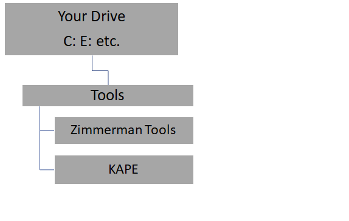

# DFRWS2019-KAPE-Workshop
This Readme page is a one stop shop for all the slides, scripts, notes, link, etc from my  2019 DFRWS KAPE Workshop.  If something is missing,  or you just are looking for some additional information,  create an issue through this GitHub repo and I will do my best to help.  My contact info is in the slide deck and at the bottom of this document.

At a minimum, before you come to the workshop, download ZimmermanTools and KAPE.  Please feel free to install and get familiar with them both.

## Installation for the Workshop

#### First,  here is the [Official KAPE Documentation by Eric Zimmerman](https://ericzimmerman.github.io/KapeDocs/#!index.md) 

It will be so helpful if each of you could download and install KAPE and ZimmermanTools before you get to the Workshop.  I anticipate the the WiFi that will be available in the meeting rooms, of which there will be more than ours, will be terrible.  So there is a possibility that you will not be able to download in the classroom.  At that point we will end USB drive will be at a premium. 

#### Download Get-ZimmermanTools.zip [from here](https://f001.backblazeb2.com/file/EricZimmermanTools/Get-ZimmermanTools.zip)

Unzip the file,  determine where you want to "install the tools" and run the command.  The tools and KAPE can be run from any device ... Hard Drive,  USB Removable drive,  etc.  It is totally portable.

Example:  The PowerShell command below

```
C:\PS> Get-ZimmermanTools.ps1 -Dest c:\tools
```

This example downloads/extracts and saves details about programs to c:\tools directory.  Change the destination drive and folder to meet you needs.

#### Download KAPE from Kroll's Website [found here](https://learn.duffandphelps.com/kape?utm_campaign=2019_cyberitbn-KAPE-launch&utm_source=kroll&utm_medium=referral&utm_term=kape-launch-blog-post) 

Unzip the files to a folder of your choice.  Here is a suggested structure for KAPE and Zimmerman tools locations.  You can put them anywhere you want, even on a thumb drive or external hard drive.

##### Example Folder Structure



#### On-Line YAML Validator Sites

https://codebeautify.org/yaml-validator
https://jsonformatter.org/yaml-validator


### Links to KAPE related Articles

[Official KAPE Documentation by Eric Zimmerman](https://ericzimmerman.github.io/KapeDocs/#!index.md) 

[Introducing KAPE!](https://binaryforay.blogspot.com/2019/02/introducing-kape.html)

[Introduction to KAPE](https://www.youtube.com/watch?v=pZRrZAJif8Q)

[Exploring KAPE’s Graphical User Interface](https://www.kroll.com/en/insights/publications/cyber/exploring-kapes-graphical-user-interface)

[Automating SFTP Creation for KAPE’s Sake!](https://medium.com/@bromiley/automating-sftp-creation-for-kapes-sake-b0bc68d10522)

[KAPE TRICKS](https://thinkdfir.com/2019/02/23/kape-tricks/)


### Commands for the Labs

##### Lab 2 Simple KAPE command that:

Collects from your own C Drive

Collects LNK FIles and Jump lists.  Run the command below and then review the results.  Look at the folders and files that were collected.  Look at any logs that were produced. Find anything interesting?  Feel feel to practice by running other targets.  All the target configurations should quickly.

`kape --tsource C: --target LnkFilesAndJumpLists --tdest F:\evidence\tdest`


### Contact Information

#### Mark Hallman

Email:   [mark.hallman@gmail.com](mailto:mark.hallman@gmail.com)  
Skype:   mhallman
Twitter:   @mhallman

