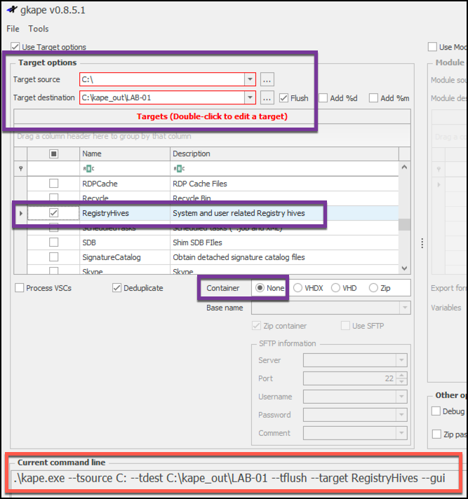

# KAPE Workshop DFRWS 2019 

This Readme page is a one stop shop for all the slides, scripts, notes, link, etc from my  2019 DFRWS KAPE Workshop.  If something is missing,  or you just are looking for some additional information,  create an issue through this GitHub repo and I will do my best to help.  My contact info is in the slide deck and at the bottom of this document.

At a minimum, before you come to the workshop, download ZimmermanTools and KAPE.  Please feel free to install and get familiar with them both.

The slide deck for the Workshop will be posted immediately after wrapping up the workshop.  

This page will change several times between now and conference.  Bookmark this page and check it a few times before you arrive at the workshop.

I hear that there are a large number of people registered for the workshop,  which it awesome but it also means that I could be spread a little thin.  Getting the tools installed on you machine or VM will be a big help.  Instructions to do that install follow.

Looking forward to seeing you all Sunday afternoon.

-Mark

## Installation for the Workshop

#### First,  here is the [Official KAPE Documentation by Eric Zimmerman](https://ericzimmerman.github.io/KapeDocs/#!index.md) 

**Second,  the update and install scripts are run PowerShell**,  that's just how it is.  But really, it is a good thing.  Come on over to the Dark Side.  Once installed and updated you can switch back to cmd if you must.  There is also a Windows GUI for KAPE which we will demo in the workshop.  

It will be so helpful if each of you could download and install KAPE and ZimmermanTools before you get to the Workshop.  I anticipate the the WiFi that will be available in the meeting rooms, of which there will be more than ours, will be terrible.  So there is a possibility that you will not be able to download in the classroom.  At that point USB drives will be at a premium.  ;-0

#### Step 1 - Download Get-ZimmermanTools.zip [from here](https://f001.backblazeb2.com/file/EricZimmermanTools/Get-ZimmermanTools.zip)

Unzip the file ,  determine where you want to "install the tools", create that folder structure if it does not exist and run the command below.  The tools and KAPE can be run from any device ... Hard Drive,  USB Removable drive,  etc.  It is totally portable.

Example:  The PowerShell command below

```
PS c:\Tools\ZimmermanTools> .\Get-ZimmermanTools.ps1 
```

This example downloads/extracts and saves details about programs to c:\Tools\ZimmermanTools directory.  Change the destination drive and folder to meet you needs.

#### Step 2 - Download KAPE from Kroll's Website [found here](https://learn.duffandphelps.com/kape?utm_campaign=2019_cyberitbn-KAPE-launch&utm_source=kroll&utm_medium=referral&utm_term=kape-launch-blog-post) 

Unzip the files to a folder of your choice. This part does not require Powershell but updating the application in the future will.   Here is a suggested structure for KAPE and Zimmerman tools locations.  You can put them anywhere you want, even on a thumb drive or external hard drive.

##### Example Folder Structure


Workshop Slide Deck


#### On-Line YAML Validator Sites

https://codebeautify.org/yaml-validator
https://jsonformatter.org/yaml-validator


### Links to KAPE related Articles

[Official KAPE Documentation by Eric Zimmerman](https://ericzimmerman.github.io/KapeDocs/#!index.md) 

[Introducing KAPE!](https://binaryforay.blogspot.com/2019/02/introducing-kape.html)

[Introduction to KAPE](https://www.youtube.com/watch?v=pZRrZAJif8Q)

[Exploring KAPE’s Graphical User Interface](https://www.kroll.com/en/insights/publications/cyber/exploring-kapes-graphical-user-interface)

[Automating SFTP Creation for KAPE’s Sake!](https://medium.com/@bromiley/automating-sftp-creation-for-kapes-sake-b0bc68d10522)

[KAPE TRICKS](https://thinkdfir.com/2019/02/23/kape-tricks/)

[RECmd_Batch_MC.reb](https://github.com/EricZimmerman/RECmd/blob/master/BatchExamples/RECmd_Batch_MC.reb) - Mike Cary's RECmd BAtch Example


### Links to Arsenal Image Mounter

[Download Arsenal Image Mounter](media/ArsenalImageMounter.zip)

[Short video on mountin images with AIM](https://twitter.com/arsenalrecon/status/1053297186308583429)


### Links to KAPE related Scripts / Code

Mike Gray's [Get-KapeModuleBinaries](https://github.com/grayfold3d/Get-KapeModuleBinaries#get-kapemodulebinaries) - Downloads binaries used by KAPE Modules


------

### Commands in the Slides

These are the command show in the slides, you can cut and paste them into to your terminal window or your editor.  Is you have trouble with a particular command referencing these may help you resolve it.

#### Targets

Collect Lnk files and Jumplists from drive C.  Save the output to G:\kape_out\tdest.

```
kape --tsource C: --target LnkFilesAndJumpLists --tdest G:\kape_out\tdest
```

Collect Evidence of Execution.  Clean up you destination folder before writing new data to it.   Save the output to a vhdx and provide the computer name as the base name for the vhdx.

```
kape --tsource C: --target EvidenceOfExecution --tflush --tdest G:\kape_out\tdest --vhdx $env:ComputerName
```

Collect all the registry hives from C and all the volume shadow copies (vss).  Cleanup your target destination before writing new data.  Your destination is on a network and is referenced by a UNC path.  Use an environment var to build the name of the vhdx.

```
kape --tsource C --target RegistryHives --vss --tflush --tdest \\<your-share>\kape_out\tdest --vhdx $env:ComputerName
```

Example showing several functions:  Multiple targets separated by commas. Collecting volume shadowcopies and depuping.  Lastly saving the collected data via SFTP to another server.  You will need to have you own ssh server and credentials to use this feature.

```
kape --tflush --tsource C: --target RegistryHives, LnkFilesAndJumpLists,EvidenceOfExecution --tdest C:\kape_out\tdest --tdd --scs 172.16.21.243 --scp 22 --scu kape-user --scpw "forensics" --vhdx $env:ComputerName

kape --tflush --tsource C: --target RegistryHives, LnkFilesAndJumpLists,EvidenceOfExecution --tdest C:\kape_out\tdest –vss --tdd
--scs 104.248.94.196 --scp 22 --scu kape-ssh --scpw "KAP3g0at" --vhdx $env:ComputerName 
```


#### Modules

Run two KAPE modules, LECmd and JLEcmd on the output from the previous run LnkFilesAndJumpLists target.

```
kape -–msource G:\kape_out\tdest -–module LECmd,JLEcmd --mdest G:\kape_out\mdest  
```

Run two KAPE modules, PECmd and AmcacheParser on the output from the previous run EvidenceOfExecution target.

```
kape --msource E:\kape_out\tdest -–module PECmd,AmcacheParser --mflush --mdest G:\kape_out\mdest
```

Run RegistryHives Target and RECmd Module to generate a comprehensive set of registry reports.  RECmd Module calls RECmd.exe using registry explorer batch file.

```
kape --tsource C --target RegistryHives --tflush --tdest G:\kape_out\tdest --vhdx $env:ComputerName --msource G:\kape_out\tdest --module RECmd --mdest G:\kape_out\mdest
```


------

### Hands on Labs

#### Target and module names, on the command line do not include the extension (.tkape or .mkape)

Theses lab questions will be added before the work starts

Using the command line version of KAPE,  collect 

#### Lab-01

Use command line or GUI version of KAPE (or maybe even try both) collect all the Registry Hives on your own system.  Flush your tdest folder before collecting any data. Write the files out to a drive of your choice but in a top level folder named `kape_out\lab-01\tdest`.  

​	How many files were copied out?  How man were deduced?  How long did it take?

Example target dest:  `--tdest C:\kape_out\LAB-01\tdest` We will being looking at the output of this command later in the workshop.  

#### LAB-01 Solution

```
kape --tsource C --target RegistryHives --vss --tflush --tdest C:\kape_out\lab-01\tdest
```





#### Lab-02

From the command line,  collect LNK file (shortcuts) & all registry files, including the volume shadow copies. Wrap them up in a vhdx with a base name of LAB-02. Save them to `kape_out\lab-02\tdest`.  I you get stuck look at the GitHub page, there are several resoures there that will help you.  Or,  build the command in GKAPE and then cut & paste the command into the command line. Looking for the target name(s) to use,  look in your `kape\targets` folder.

```
.\kape.exe --tsource C: --tdest G:\kape_out\LAB-02\tdest --tflush --target LnkFilesAndJumpLists,RegistryHives --vss --vhdx LAB-02 --gui
```


#### Lab-03 

Run the compound target named !BasicCollection of your own system.  This target is a good example of the typical artificats you might want to collect from a Windows system in a triage situation.  There are many targets that will be called by this compound target.  Save the data to a vhdx with a base name of the the computer name in a folder named `kape_out\LAB-03\tdest`

```
kape --tflush --tsource C: --target !BasicCollection --tdest C:\kape_out\LAB-03\tdest --vss --vhdx $env.ComputerName
```

#### Lab-04

Using Notepad or any editor of you choice,  review the Console_Log.txt that resulted from Lab-01 - Lab-03.  They should all look different becaue different targets were run.  Spend just a few minutes on each one as you are really just trying to a get a quick feel for the kind of infomation that can be found here.


#### Lab-05

Launch TimeLine Explorer (TLE).  It is found in the ZImmerTools/Timeline Explorer folder. You should have installed ZImmerman Tools at the same time that you installed KAPE.  If you did not install TLE and you have Excel or another spreadsheet, you can use that to review the csv's

Using TLE load the CopyLog.csv file for one of your target runs.  Use TLE to filter the data.  Use TLE to sort by date.  Just experiment a little,  look at the info in the CopyLog.csv and how powerful TLE is.

#### Lab-06

Unzip and mount the VHDX file created in Lab-02 or Lab-03.  Mounting is just a matter of double clicking on the unzipped VHDX.  What drive letter was it assigned?  Can you navigate through the folder structure?  Can you see that the folder structure was preserved?

#### Lab-07

Run the RECmd module to process all the registry files that were collected in LAB-01.  RECmd calls a Registry Explorer batch file to does some really impressive processing.  I want you to know that this kind of power is possible with KAPE and for now,  just o run how run it.  Creating this kind of module and the associated Registry Explorer batch file is beyond the scope of this workshop.  But,  if you study the examples and read the Registry Explorer docs,  you can create your own.

Review all the csv's this modules produces.  Load some of them up in Timeline Explorer and look at the data.

```
kape --msource F:\kape_out\LAB-01\tdest --module RECmd --mdest F:\kape_out\LAB-04\mdest
```

#### Lab-08


#### Lab-09

Module processing.  Look at the elements in the target !Basic Processing (run in Lab-03) and run some modules to process it.  Just wanting you to find 2 - 3 modules that would process the artifacts collected by this target.  Hint:  Evidence of Execution is a compound target,  meaing the it expands and there are more target inside that name.  

Construct a tape module command to process the output from Lab-03.  Remember that Lab-03 saved it's data to a vhdx so you will need to mount it before you can run your list of modules against it.  


```
kape --msource K:\C  --module EvtxECmd,Prefetch,PECmd,JLECmd,LECmd,MFTECmd_$MFT,WxTCmd --mdest G:\kape_out\Lab-09\mdest --mflush
```

The value for --msource looks different that we have seen becuase the module source is the mounted VHDX.


### Contact Information

#### Mark Hallman

Email:   [mark.hallman@gmail.com](mailto:mark.hallman@gmail.com)  
Skype:   mhallman
Twitter:   @mhallman

